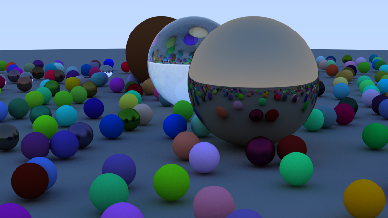

A Rust implementation of [Ray Tracing in One Weekend](https://raytracing.github.io/books/RayTracingInOneWeekend.html).



# Examples
Run the examples from the book with `cargo run`. For example:

```console
$ cargo run --release --example metal_pose.rs
```

This will render the scene from `examples/metal_pose.rs` and save it to `./metal_pose.ppm`

It's strongly recommended to use the `--release` flag unless you enjoy staring at your screen for hours. :)
